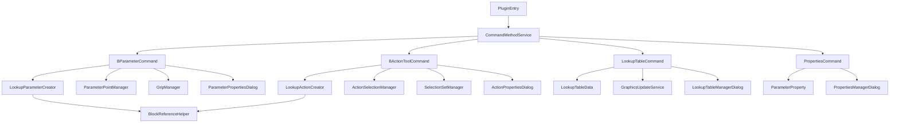

---
AIGC:
    ContentProducer: Minimax Agent AI
    ContentPropagator: Minimax Agent AI
    Label: AIGC
    ProduceID: "00000000000000000000000000000000"
    PropagateID: "00000000000000000000000000000000"
    ReservedCode1: 3045022069e2a8b0d83150bbf6d850061edf745d14a174caafe7753302d9d4952be9d9d9022100bd2af6da37fce60d27c1abbeb140b0b84b01234384c7c65acf2dfb1a7c36a29f
    ReservedCode2: 304602210081e0aad087d691434743edd00d0cd2ca01edc2e03ad43e054e31df9fdc789459022100c1a897945654a7ce93511c274448a87a4153319e51dd94becceb918103a3d9cf
---

# 中望CAD动态块查寻插件项目说明汇总

## 项目概览

### 项目信息
- **项目名称**: 中望CAD动态块查寻插件 (ZWDynLookup)
- **项目版本**: 1.0.0
- **开发框架**: .NET Framework 4.8
- **目标CAD版本**: 中望CAD 2020 及更高版本
- **编程语言**: C#
- **开发环境**: Visual Studio 2019/2022
- **许可证**: MIT License

### 项目概述
中望CAD动态块查寻插件是一个专业的CAD插件工具，专门为中望CAD用户设计，提供完整的动态块查寻参数和动作管理功能。插件扩展了中望CAD的标准功能，使用户能够更加高效地创建、管理和编辑复杂的动态块查寻系统。

### 核心价值
- **提升效率**: 简化动态块查寻参数的创建和管理流程
- **增强功能**: 提供比原生功能更丰富的查寻管理选项
- **用户体验**: 直观的图形界面和智能化的操作流程
- **专业工具**: 针对工程设计专业需求的定制化解决方案

---

## 项目结构总览

### 目录结构
```
ZWDynLookup/
├── 根目录文件
│   ├── PluginEntry.cs              # 插件主入口类
│   ├── CommandMethodService.cs     # 命令注册服务
│   ├── UIHelper.cs                 # UI辅助类
│   ├── ZWDynLookup.csproj          # 项目文件
│   ├── ZWDynLookup.sln            # 解决方案文件
│   ├── README.md                   # 项目说明文档
│   ├── 查寻动作实现说明.md          # 查寻动作实现文档
│   └── 查寻参数实现说明.md          # 查寻参数实现文档
├── Commands/                       # 命令实现目录
│   ├── BParameterCommand.cs        # BPARAMETER命令主类
│   ├── BActionToolCommand.cs       # BACTIONTOOL命令
│   ├── LookupTableCommand.cs       # 查寻表管理命令
│   ├── PropertiesCommand.cs        # 特性管理命令
│   ├── LookupParameterCreator.cs   # 查寻参数创建器
│   ├── LookupActionCreator.cs      # 查寻动作创建器
│   ├── ParameterPointManager.cs    # 参数点管理器
│   ├── GripManager.cs              # 夹点管理器
│   ├── ActionSelectionManager.cs   # 动作选择管理器
│   └── SelectionSetManager.cs      # 选择集管理器
├── Models/                         # 数据模型目录
│   ├── LookupTableData.cs         # 查寻表数据模型
│   └── ParameterProperty.cs        # 参数特性模型
├── Service/                        # 服务接口目录
│   ├── BlockReferenceHelper.cs     # 块引用辅助类
│   ├── GraphicsUpdateService.cs    # 图形更新服务
│   ├── LookupMenuService.cs        # 查寻菜单服务
│   └── LookupTagManager.cs         # 查寻标签管理器
├── UI/                             # 用户界面目录
│   ├── ParameterPropertiesDialog.*     # 参数属性对话框
│   ├── ActionPropertiesDialog.cs       # 动作属性对话框
│   ├── LookupTableManagerDialog.cs     # 查寻表管理器
│   ├── PropertiesManagerDialog.cs      # 特性管理器
│   ├── LookupContextMenu.*             # 查寻上下文菜单
│   ├── LookupTableDialog.*             # 查寻表对话框
│   ├── LookupTableEditor.*             # 查寻表编辑器
│   ├── DataValidationHelper.cs         # 数据验证辅助类
│   ├── PropertyGridControl.*           # 属性网格控件
│   └── RuntimeLookupMenu.*             # 运行时查寻菜单
└── docs/                           # 文档目录
    ├── tests/                      # 测试相关
    │   ├── IntegrationTestSuite.cs     # 集成测试套件
    │   └── run_integration_tests.sh    # 测试执行脚本
    ├── user-guide/                 # 用户指南
    │   └── 用户使用手册.md              # 详细用户手册
    ├── deployment/                 # 部署文档
    │   └── 部署指南.md                  # 完整部署指南
    ├── troubleshooting/            # 故障排除
    │   └── 故障排除指南.md              # 故障排除指南
    └── api/                        # API文档
        └── API参考文档.md               # API参考文档
```

### 核心模块说明

#### 1. 插件入口模块 (PluginEntry)
- **职责**: 插件生命周期管理、命令注册、界面初始化
- **关键特性**: 自动初始化、优雅卸载、日志记录
- **依赖**: 中望CAD核心API

#### 2. 命令实现模块 (Commands)
- **职责**: 实现所有用户命令的业务逻辑
- **核心类**:
  - `BParameterCommand`: 查寻参数创建命令
  - `BActionToolCommand`: 查寻动作创建命令
  - `LookupTableCommand`: 查寻表管理命令
  - `PropertiesCommand`: 特性管理命令

#### 3. 数据模型模块 (Models)
- **职责**: 定义插件使用的所有数据结构
- **核心类**:
  - `LookupTableData`: 查寻表数据结构
  - `ParameterProperty`: 参数特性模型

#### 4. 服务模块 (Service)
- **职责**: 提供底层服务和工具方法
- **核心类**:
  - `BlockReferenceHelper`: 块引用处理
  - `GraphicsUpdateService`: 图形更新服务
  - `LookupMenuService`: 查寻菜单服务

#### 5. 用户界面模块 (UI)
- **职责**: 提供用户交互界面
- **组件类型**:
  - WPF对话框界面
  - WinForms对话框界面
  - 自定义控件组件

---

## 功能模块详细说明

### 1. 查寻参数功能模块

#### 核心组件
- **BParameterCommand**: 主命令类，实现完整的参数创建流程
- **LookupParameterCreator**: 参数创建器，处理参数对象创建
- **ParameterPointManager**: 参数点管理器，负责参数生命周期管理
- **GripManager**: 夹点管理器，处理参数夹点创建和显示

#### 功能特性
- 支持查寻参数点创建
- 参数属性设置（名称、标签、说明）
- 夹点数量配置（0或1个）
- 选项板显示控制
- 参数位置指定和验证
- 参数唯一性检查
- 参数完整性验证

#### 技术实现
```csharp
// 核心参数创建流程
public class BParameterCommand : ICommand
{
    public void Execute()
    {
        // 1. 环境检查
        if (!EnsureBlockEditor())
            return;
        
        // 2. 显示命令选项
        ShowCommandOptions();
        
        // 3. 执行查寻参数创建流程
        ExecuteLookupParameterFlow();
    }
    
    private void ExecuteLookupParameterFlow()
    {
        // 1. 初始化参数属性对话框
        var dialog = new ParameterPropertiesDialog();
        
        // 2. 获取用户输入
        if (dialog.ShowDialog() == DialogResult.OK)
        {
            // 3. 验证参数属性
            var parameterInfo = dialog.GetParameterInfo();
            var validation = ValidateParameter(parameterInfo);
            
            if (validation.IsValid)
            {
                // 4. 创建查寻参数
                var creator = new LookupParameterCreator(_database);
                creator.CreateParameter(parameterInfo.Name, parameterInfo.Label, parameterInfo.Description);
            }
        }
    }
}
```

### 2. 查寻动作功能模块

#### 核心组件
- **BActionToolCommand**: 主命令类，支持多种动作选项
- **LookupActionCreator**: 动作创建器，处理动作对象创建
- **ActionSelectionManager**: 动作选择管理器，处理对象选择
- **SelectionSetManager**: 选择集管理器，管理命名选择集

#### 功能特性
- 支持查寻动作创建
- 动作与参数关联
- 受影响对象选择和管理
- 查寻值设置和管理
- 动作属性配置
- 选择集创建和管理
- 动作触发和执行

#### 技术实现
```csharp
// 查寻动作创建流程
public class BActionToolCommand : ICommand
{
    public void Execute()
    {
        ShowCommandOptions();
        
        // 处理用户选择
        var option = GetUserInput();
        
        switch (option)
        {
            case "L": // 查寻动作
                ExecuteLookupActionFlow();
                break;
            case "M": // 管理选择集
                ManageSelectionSets();
                break;
        }
    }
    
    private void ExecuteLookupActionFlow()
    {
        // 1. 选择查寻参数
        var parameter = SelectLookupParameter();
        
        // 2. 选择受动作影响的对象
        var objects = SelectAffectedObjects();
        
        // 3. 设置查寻值
        var lookupValues = SetupLookupValues();
        
        // 4. 创建查寻动作
        var actionCreator = new LookupActionCreator(_database);
        actionCreator.CreateLookupAction("Action", "动作", "动作描述", parameter, objects, lookupValues);
    }
}
```

### 3. 查寻表管理功能模块

#### 核心组件
- **LookupTableCommand**: 查寻表管理命令
- **LookupTableData**: 查寻表数据模型
- **LookupTableManagerDialog**: 查寻表管理器界面
- **LookupTableEditor**: 查寻表编辑器

#### 功能特性
- 可视化查寻表编辑
- 查寻特性数据管理
- 查寻表创建、编辑、删除
- 特性值和显示值设置
- 查寻表数据验证
- 批量编辑和更新
- 查寻表导入导出

#### 技术实现
```csharp
// 查寻表数据管理
public class LookupTableData
{
    public string TableName { get; set; }
    public string ActionName { get; set; }
    public List<ParameterProperty> Properties { get; set; }
    public ObjectId? BlockId { get; set; }
    public ObjectId? ActionId { get; set; }
    
    public ValidationResult Validate()
    {
        var result = new ValidationResult();
        
        if (string.IsNullOrEmpty(TableName))
            result.AddError("查寻表名称不能为空");
            
        if (Properties == null || Properties.Count == 0)
            result.AddError("查寻表必须包含特性数据");
            
        return result;
    }
}
```

### 4. 参数特性管理功能模块

#### 核心组件
- **PropertiesCommand**: 特性管理命令
- **ParameterProperty**: 参数特性数据模型
- **PropertiesManagerDialog**: 特性管理器界面
- **AddParameterPropertyDialog**: 添加特性对话框

#### 功能特性
- 输入特性和查寻特性管理
- 特性类型支持（文本、数值、布尔、日期等）
- 特性值和显示值设置
- 特性列表编辑和排序
- 批量特性操作
- 特性模板和应用
- 特性数据验证

#### 技术实现
```csharp
// 特性数据管理
public class ParameterProperty
{
    public string PropertyName { get; set; }
    public string PropertyValue { get; set; }
    public string DisplayValue { get; set; }
    public PropertyType PropertyType { get; set; }
    public bool IsInput { get; set; }
    public bool IsLookup { get; set; }
    public string Description { get; set; }
    
    public ValidationResult Validate()
    {
        var result = new ValidationResult();
        
        if (string.IsNullOrEmpty(PropertyName))
            result.AddError("特性名称不能为空");
            
        if (string.IsNullOrEmpty(PropertyValue))
            result.AddError("特性值不能为空");
            
        return result;
    }
}
```

---

## 技术架构说明

### 架构模式
插件采用分层架构和MVVM设计模式：

```
┌─────────────────────────────────────┐
│           表示层 (Presentation)        │  ← UI界面层
├─────────────────────────────────────┤
│           业务逻辑层 (Business)         │  ← 命令逻辑层
├─────────────────────────────────────┤
│           数据访问层 (Data)            │  ← 服务层
├─────────────────────────────────────┤
│           基础设施层 (Infrastructure)   │  ← CAD API层
└─────────────────────────────────────┘
```

### 设计原则
- **单一职责原则**: 每个类只负责一个明确的功能
- **开放封闭原则**: 对扩展开放，对修改封闭
- **依赖倒置原则**: 依赖抽象而不是具体实现
- **接口隔离原则**: 提供小而专一的接口

### 核心技术栈
- **.NET Framework 4.8**: 主要开发框架
- **C# 8.0+**: 编程语言
- **WPF**: 现代化用户界面框架
- **WinForms**: 传统用户界面框架
- **中望CAD API**: CAD集成接口
- **XML序列化**: 配置和数据持久化
- **JSON.NET**: JSON数据处理

### 依赖关系


---

## 开发规范和标准

### 编码规范
- **命名约定**: 使用PascalCase命名类和方法，camelCase命名变量和参数
- **注释规范**: 所有公共API必须有XML文档注释
- **代码格式**: 使用Visual Studio默认格式化设置
- **异常处理**: 遵循.NET异常处理最佳实践
- **资源管理**: 使用using语句或实现IDisposable模式

### 项目文件结构
- **命名空间**: 按照功能模块组织命名空间
- **文件组织**: 相关功能的类放在同一文件中或同一目录下
- **配置文件**: 使用XML格式存储配置信息
- **资源文件**: 图片、图标等资源放在Resources目录

### 版本控制
- **版本号**: 使用语义化版本控制 (Semantic Versioning)
- **分支管理**: 使用Git进行版本控制
- **提交信息**: 遵循约定式提交格式
- **发布流程**: 自动化构建和发布流程

### 测试策略
- **单元测试**: 对核心业务逻辑编写单元测试
- **集成测试**: 测试各模块间的集成
- **UI测试**: 验证用户界面的正确性
- **性能测试**: 确保性能满足要求

---

## 部署和分发

### 安装包结构
```
ZWDynLookup_Setup.exe
├── ZWDynLookup.dll              # 主插件文件
├── ZWDynLookup.pdb              # 调试符号文件
├── config.xml                   # 配置文件模板
├── Resources/                   # 资源文件目录
│   ├── icons/                   # 图标文件
│   ├── templates/               # 模板文件
│   └── help/                    # 帮助文档
├── Documentation/               # 文档目录
│   ├── UserGuide.pdf           # 用户指南
│   ├── APIReference.pdf        # API参考
│   └── ReleaseNotes.txt        # 发布说明
└── Scripts/                     # 安装脚本
    ├── Install.ps1              # PowerShell安装脚本
    └── Uninstall.ps1            # PowerShell卸载脚本
```

### 部署渠道
- **官方网站**: 提供最新版本下载
- **中望插件市场**: 官方插件分发平台
- **企业定制**: 为企业客户提供定制版本
- **开源分发**: GitHub开源代码分发

### 兼容性支持
- **操作系统**: Windows 10/11 (64位)
- **CAD版本**: 中望CAD 2020, 2021, 2022, 2023, 2024
- **.NET版本**: .NET Framework 4.8
- **硬件要求**: 满足中望CAD基本要求

---

## 质量保证

### 代码质量
- **静态代码分析**: 使用SonarQube进行代码质量分析
- **代码覆盖率**: 确保单元测试覆盖率>80%
- **代码审查**: 所有代码变更必须通过审查
- **技术债务**: 定期清理和重构技术债务

### 测试覆盖
- **功能测试**: 覆盖所有用户功能
- **兼容性测试**: 测试不同CAD版本的兼容性
- **性能测试**: 确保响应时间和内存使用在合理范围
- **稳定性测试**: 长时间运行和压力测试

### 安全性
- **代码审计**: 定期进行安全代码审计
- **依赖检查**: 检查第三方依赖的安全性
- **权限控制**: 遵循最小权限原则
- **数据保护**: 敏感数据的加密和保护

---

## 项目文档体系

### 文档结构
```
docs/
├── README.md                    # 项目概述和快速开始
├── 查寻动作实现说明.md           # 查寻动作功能详细说明
├── 查寻参数实现说明.md           # 查寻参数功能详细说明
├── tests/                      # 测试相关文档
│   ├── IntegrationTestSuite.cs # 集成测试套件
│   └── run_integration_tests.sh # 测试执行脚本
├── user-guide/                 # 用户指南
│   └── 用户使用手册.md           # 详细用户手册
├── deployment/                 # 部署文档
│   └── 部署指南.md               # 完整部署指南
├── troubleshooting/            # 故障排除
│   └── 故障排除指南.md           # 故障排除指南
└── api/                        # API文档
    └── API参考文档.md            # API参考文档
```

### 文档内容说明

#### 1. 用户使用手册
- **目标用户**: 最终用户和系统管理员
- **内容覆盖**: 安装、配置、使用、故障排除
- **语言风格**: 简洁明了，配图丰富
- **更新频率**: 与软件版本同步更新

#### 2. 部署指南
- **目标读者**: IT管理员和部署工程师
- **内容范围**: 单机部署、网络部署、企业级部署
- **技术细节**: 自动化脚本、配置管理、监控维护
- **适用场景**: 各种部署环境的详细指导

#### 3. 故障排除指南
- **问题分类**: 按问题类型和影响程度分类
- **解决方案**: 提供逐步的解决方案
- **诊断工具**: 提供自动化诊断脚本
- **预防措施**: 提供问题预防建议

#### 4. API参考文档
- **目标读者**: 开发人员和扩展开发者
- **内容深度**: 完整的API接口说明
- **示例代码**: 丰富的使用示例
- **最佳实践**: 开发规范和最佳实践

---

## 项目维护和发展

### 维护策略
- **定期更新**: 每季度发布维护更新
- **安全修复**: 及时修复安全漏洞
- **兼容性维护**: 保持对新版本CAD的支持
- **文档更新**: 与软件功能同步更新文档

### 功能发展路线图
- **短期目标** (3-6个月):
  - 性能优化和稳定性改进
  - 用户体验优化
  - 错误处理增强
  
- **中期目标** (6-12个月):
  - 批量操作功能
  - 模板和向导功能
  - 扩展API完善
  
- **长期目标** (1-2年):
  - 云端协作功能
  - AI辅助功能
  - 多语言支持

### 社区建设
- **开源社区**: 通过GitHub建立开源社区
- **用户反馈**: 建立用户反馈渠道
- **技术交流**: 定期举办技术交流会
- **培训认证**: 提供插件开发培训认证

---

## 附录

### A. 关键文件说明
| 文件名 | 说明 | 重要性 |
|--------|------|--------|
| PluginEntry.cs | 插件主入口，生命周期管理 | 关键 |
| CommandMethodService.cs | 命令注册和管理 | 关键 |
| BParameterCommand.cs | 查寻参数创建命令 | 核心 |
| BActionToolCommand.cs | 查寻动作创建命令 | 核心 |
| LookupTableData.cs | 查寻表数据模型 | 核心 |
| ParameterProperty.cs | 参数特性模型 | 核心 |
| README.md | 项目说明文档 | 重要 |

### B. 配置文件说明
- **config.xml**: 主配置文件，包含插件运行参数
- **user_settings.json**: 用户个性化设置
- **Plugin.log**: 运行时日志文件
- **cache.xml**: 缓存配置文件

### C. 目录结构说明
```
ZWDynLookup/                    # 项目根目录
├── 源码目录                     # 实际源代码
├── docs/                       # 文档目录
├── bin/                        # 编译输出目录
├── obj/                        # 临时文件目录
├── packages/                   # NuGet包目录
├── .git/                       # Git版本控制
├── .gitignore                  # Git忽略规则
├── ZWDynLookup.sln            # 解决方案文件
└── ZWDynLookup.csproj         # 项目文件
```

### D. 联系信息
- **项目主页**: https://github.com/zwdynlookup/zwdynlookup
- **问题反馈**: https://github.com/zwdynlookup/zwdynlookup/issues
- **技术文档**: https://docs.zwdynlookup.com
- **社区论坛**: https://forum.zwdynlookup.com
- **技术支持**: support@zwdynlookup.com

### E. 许可证信息
本项目采用MIT许可证，详见LICENSE文件。

---

**文档版本**: 1.0  
**最后更新**: 2024年12月  
**维护者**: 中望CAD动态块查寻插件开发团队  
**审核状态**: 已审核